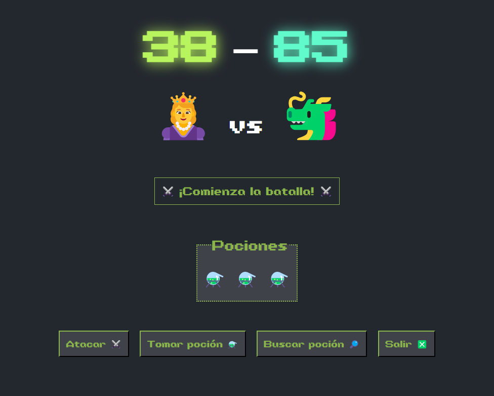

# 👸 Princesa VS Dragón 🐲

_Un sencillo minijuego en donde se encarna a una princesa en una batalla frente a un dragón. Creado con HTML, CSS y JS nativo._

## 🪄 Demo
https://princesa-vs-dragon.vercel.app

## 📋 Requisitos
Los requisitos de este minijuego nacen de una de las tareas realizadas para el módulo de Entorno Cliente (DAW). Como una manera de practicar el manejo del DOM a través de JS nativo, la tarea establece los siguientes requisitos:

---
> Crear un juego de combate contra un monstruo. El juego debe contar con las siguientes variables:
> - Vida jugadora
> - Vida monstruo
> - Cantidad de pociones
> - Ataque máximo jugadora
> - Ataque máximo monstruo
> - Curación máxima poción
> - Todos los valores anteriores deben ser números enteros.
>
> El juego debe tener las siguientes acciones posibles:
> - **ATACAR MONSTRUO:** genera un número aleatorio entre 1 y `Ataque máximo jugadora` y lo resta a `Vida monstruo`.
> - **TOMAR POCIÓN:** genera un número aleatorio entre 1 y `Curación máxima poción` y lo suma a `Vida jugadora` y resta 1 a `Cantidad de pociones`.
> - **BUSCAR POCIÓN:** genera un número entre 1 y 4, si sale 1 suma una poción, sino no encuentra nada.
> - **SALIR:** termina el programa.
> 
> Y, por último, se deben cumplir una serie de requisitos durante la partida:
> - En todo momento se debe mostrar un mensaje de lo que está ocurriendo.
> - Luego de cada acción, el monstruo ataca a la jugadora y le resta a `Vida jugadora` un número aleatorio entre 1 y `Ataque máximo monstruo`.
> - Luego del ataque del monstruo, se debe mostrar la vida de ambos.
> - El programa termina cuando o la jugadora o el monstruo se quedan con vida igual o menor a 0.
> - Mostrar un mensaje con el resultado final.
---

## 🛠️ Características a arreglar / mejorar
* Revisar el código JS y rehacer aquellas partes que lo precisen para que éstas cumplan con los principios SOLID, resultando en un código más eficiente y sencillo de mantener.
* Se podría añadir una sección de historial de partidas a través del `LocalStorage` del navegador, de forma que se vayan almacenando en una tabla el día y hora de la partida, las stats con las que se inició la partida y el resultado final.

## ✒️ Autorías ajenas
* Emojis animados de la página principal por <a href='https://animated-fluent-emoji.vercel.app' target='_blank' rel='noreferrer'>Animated Fluent Emojis</a>.

## 📎Lo utilizado

